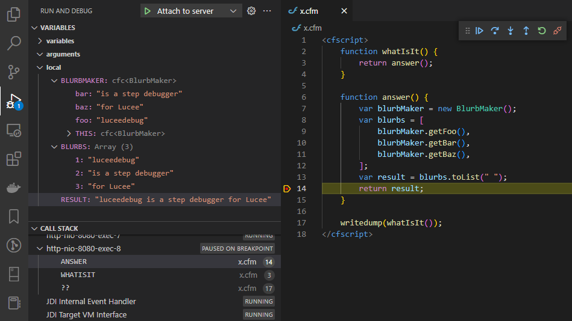
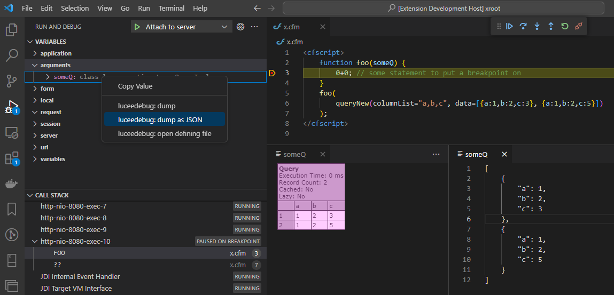

# luceedebug

luceedebug is a step debugger for Lucee.



There are two components:

- A Java agent
- A VS Code extension

The java agent needs a particular invocation and needs to be run as part of the JVM/Lucee server startup.

The VS Code client extension is available as `luceedebug` when searching in the VS Code extensions pane (or it can be built locally, see subsequent instructions).

## Java Agent

### Build Agent Jar

The following steps will build to: `./luceedebug/build/libs/luceedebug.jar`

#### Build Agent Jar on Mac / Linux

```
cd luceedebug
./gradlew shadowjar
```

#### Build Agent Jar on Windows

```
cd luceedebug
gradlew.bat shadowjar
```

### Install and Configure Agent

Note that you must be running a JDK version of your java release (a common error on startup when running "just" a JRE is `java.lang.NoClassDefFoundError: com/sun/jdi/Bootstrap`).

Add the following to your java invocation. (Tomcat users can use the `setenv.sh` file for this purpose.)

```
-agentlib:jdwp=transport=dt_socket,server=y,suspend=n,address=localhost:9999

-javaagent:/abspath/to/luceedebug.jar=jdwpHost=localhost,jdwpPort=9999,debugHost=0.0.0.0,debugPort=10000,jarPath=/abspath/to/luceedebug.jar
```

* `agentlib`: Configures JDWP, which is the lower-level Java debugging protocol that the luceedebug agent connects with. (Note: The VS Code debugger connects to the _luceedebug_ agent, not JDWP, so JDWP/`agentlib` usually doesn't need to be modified/customized.)
  * `address`: Leave this as `localhost:9999`, unless you have a compelling reason to change it (e.g., if some other service is already listening on port 9999).
  * All other arguments should be used verbatim unless you have a compelling reason to change them.
* `javaagent`: Configures the luceedebug agent, itself.
  * `/abspath/to/luceedebug.jar` (the first token in the `javaagent`): The absolute path by which your server can find the luceedebug agent library. You must change this to match your environment.
  * `jdwpHost`/`jdwpPort`: The luceedebug agent connects to JDWP via this host/port. These values must match those in `agentlib`'s `address`.
  * `debugHost`/`debugPort`: These configure the host/port that the VS Code debugger attaches to.
  
    Set this to the interface on which you want the debugger to listen. In non-docker environments, this would be the IP address of a particular interface.
    
    If Lucee is running in a docker container, the `debugHost` _must_ be `0.0.0.0` (i.e., "listen on all interfaces"). However, be careful not to use this value on a publicly-accessible, unprotected server, as you could expose the debugger to the public (which would be a major security vulnerability).
  * `jarPath`: This value must be identical to the first token in the `javaagent` arguments. Unfortunately, we have to specify the path twice! One tells the JVM which jar to use as a java agent, the second is an argument specifying from where the java agent will load debugging instrumentation.
  
    (There didn't seem to be an immediately obvious way to pull the name of "the current" jar file from an agent's `premain`, but maybe it's just been overlooked. If you know let us know!)

### VS Code luceedebug Debugger Extension

#### Install and Run from VS Code Marketplace

The VS Code luceedebug extension is available on the VS Code Marketplace. If you are an end-user who just wants to start debugging your CFML, install the luceedebug extension from the Marketplace.

##### Run the Extension

- Go to the "run and debug" menu (looks like a bug with a play button)
- Add a CFML debug configuration (if you haven't already--it only needs to be done once): Run > Open Configurations. (See the [configuration example, below](#vs-code-extension-configuration).)
- Attach to the Lucee server
  - With a CFML file open, click the "Run and Debug" icon in the left menu.
  - In the select list labeled "Run and Debug," choose the name of the configuration you used in the `name` key of the debug configuration. (In the [configuration example, below](#vs-code-extension-configuration), it would be `Project A`.)
  - Click the green "play" icon next to the select list, above.
- General step debugging is documented [here](https://code.visualstudio.com/docs/editor/debugging), but the following is a synopsis.
  - With a CFML file open, click in the margin to the left of the line number, which will set a breakpoint (represented by a red dot).
  - Use your application in a way that would reach that line of code.
  - The application will pause execution at that line of code and allow you to inspect the current state.
  - The debug navigation buttons will allow you to continue execution or step into and out of functions, etc.

#### Hacking the luceedebug Extension

If you want to hack the extension, itself, build/run instructions follow.

##### Build Extension

Prerequisites:
* `npm`
* `typescript`
  * Mac: `brew install typescript`

```
# vs code client
cd vscode-client
npm install

npm run build-dev-windows # windows
npm run build-dev-linux # mac/linux
```

##### Run the Self-Built Extension

Steps to run the extension in VS Code's "extension development host":
- Open VS Code in this dir
  ```
  cd vscode-client
  code . # open vs code in this dir
  ```
- Go to the "run and debug" menu (looks like a bug with a play button)
- In the select list labeled "Run and Debug," choose the "Launch luceedebug in Extension Development Host" option and click the green "play" icon to launch.
- The extension development host window opens
- Load your Lucee project from that VS Code instance
- Continue on to [Run the Extension](#run-the-extension)


### VS Code Extension Configuration

A CFML debug configuration looks like:
```json
{
    "type": "cfml",
    "request": "attach",
    "name": "Project A",
    "hostName": "localhost",
    "port": 10000,
    // optional; only necessary when ide and lucee paths don't match
    "pathTransforms": [
      {
        "idePrefix": "${workspaceFolder}",
        "serverPrefix": "/app"
      }
    ]
}
```
`hostName`/`port` should match the `debugHost`/`debugPort` of the Java agent's configuration. (There are exceptions; e.g., on remote hosts where DNS and/or port forwarding are in play.)

#### Mapping Paths with `pathTransforms`


`pathTransforms` maps between "IDE paths" and "Lucee server paths". For example, in your editor, you may be working on a file called `/foo/bar/baz/TheThing.cfc`, but it runs in a container and Lucee sees it as `/serverAppRoot/bar/baz/TheThing.cfc`.

In the case of local debugging (when there are no virtual machines or containers involved), you may not need a `pathTransforms` configuration, because both your IDE and Lucee probably know any given CFML file by the same path name.

However, in environments where the IDE path of a CFML file isn't identical to the Lucee path, luceedebug needs to know how to transform these paths.

Currently, it is a simple prefix replacement, e.g.:

```json
"pathTransforms": [
  {
    "idePrefix": "/foo",
    "serverPrefix": "/serverAppRoot"
  }
]
```

In the above example, the IDE would announce, "set a breakpoint in `/foo/bar/baz/TheThing.cfc`, which the server will understand as "set a breakpoint in `/serverAppRoot/bar/baz/TheThing.cfc`".

Omitting `pathTransforms` means no path transformation will take place. (It can be omitted when IDE paths match server paths.)

Multiple `pathTransforms`  may be specified if more than one mapping is needed. The first match wins.

Example:

```json
"pathTransforms": [
  {
    "idePrefix": "/Users/sc/projects/subapp_b_helper",
    "serverPrefix": "/var/www/subapp/b/helper"
  },
  {
    "idePrefix": "/Users/sc/projects/subapp_b",
    "serverPrefix": "/var/www/subapp/b"
  },
  {
    "idePrefix": "/Users/sc/projects/app",
    "serverPrefix": "/var/www"
  }
]
```

In this example:

* A breakpoint set on `/Users/sc/projects/app/Application.cfc` will match the last transform and map to `/var/www/Application.cfc` on the server.
* A breakpoint set on `/Users/sc/projects/subapp_b_helper/HelpUtil.cfc` will match the first transform and map to `/var/www/subapp/b/helper/HelpUtil.cfc` on the server.

---
### Misc.
#### writedump / serializeJSON

`writeDump(x)` and `serializeJSON(x)` data visualizations are made available as context menu items from within the debug variables pane. Right-clicking on a variable brings up the menu:



and results are placed into an editor tab.